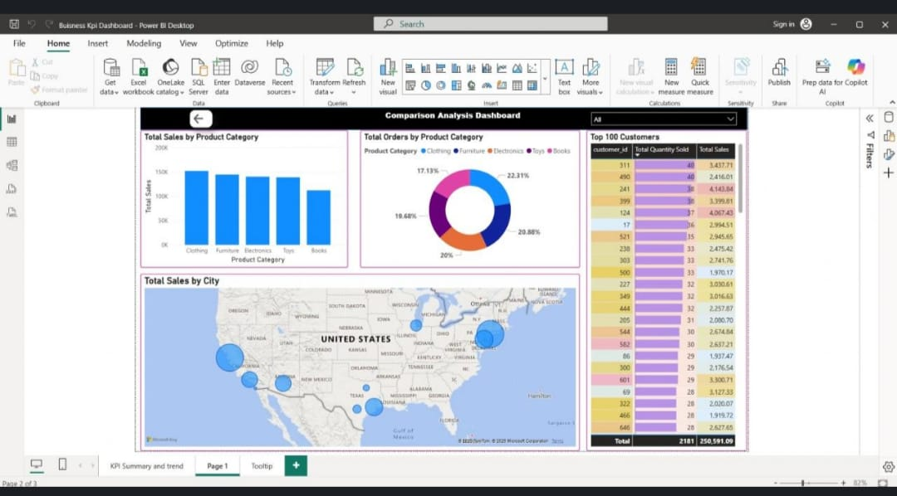
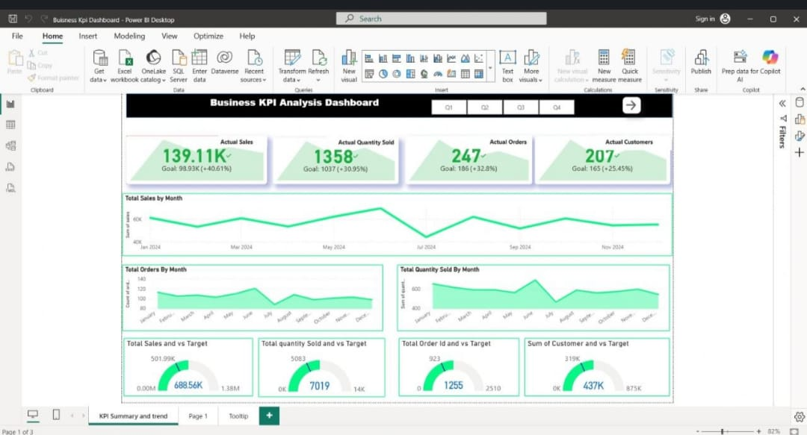

🌈 SPECTRUM Retail Analytics

  
 
  

📊 Project Overview
Developed a comprehensive retail analytics solution named SPECTRUM Retail Analytics, consisting of two powerful and interconnected dashboards designed to provide a 360° view of business performance. This project transforms raw retail data into meaningful insights by combining KPI monitoring, customer analysis, product performance, and geographical insights into a single analytical ecosystem.

The dashboards are built with a strong focus on decision-making, performance tracking, and business intelligence storytelling, making it highly valuable for stakeholders and business managers.

📈 Dashboard 1: Business KPI Analysis

🎯 Objective:
To monitor overall business performance against targets and track key metrics in real time.

🔍 Key Insights & Analysis

💰 Tracked Actual Sales vs Target, achieving strong positive growth

📦 Monitored Quantity Sold and Order Volume trends across months

👥 Analyzed Customer acquisition and engagement metrics

📅 Visualized monthly sales trends to identify peak and low-performing periods

🎯 Compared KPIs against predefined targets using intuitive gauge visuals

📊 Provided a quick executive summary using KPI cards for faster decision-making

🧠 What Makes It Powerful

⚡ Real-time performance tracking

📉 Early detection of underperformance

📊 Clear comparison between goals vs achievements

📊 Dashboard 2: Comparison & Customer Analysis

🎯 Objective:
To analyze product category performance, customer contribution, and geographical sales distribution.

🔍 Key Insights & Analysis

🛍️ Compared Total Sales across Product Categories (Clothing, Furniture, Electronics, etc.)

📦 Analyzed Order distribution by category using interactive donut charts

👑 Identified Top 100 high-value customers contributing maximum revenue

🌍 Visualized city-wise sales distribution using map-based insights

📊 Highlighted category-wise contribution to total business performance

💡 Uncovered customer purchasing patterns and high-value segments

🧠 What Makes It Powerful

🎯 Focus on customer-centric analysis

🌍 Geographical insights for expansion strategy

💰 Identification of revenue-driving segments

🛠️ Tools & Technologies

📊 Power BI (Dashboard Development & Data Visualization)

📑 Excel / CSV Data Sources

🧠 Data Modeling & KPI Design

💡 Business Impact

🚀 Enabled data-driven decision-making through clear KPI tracking

📈 Improved sales performance visibility across categories and regions

👥 Helped identify high-value customers and retention opportunities

📦 Supported product and inventory optimization strategies

🎯 Provided a complete retail performance overview in a single solution
